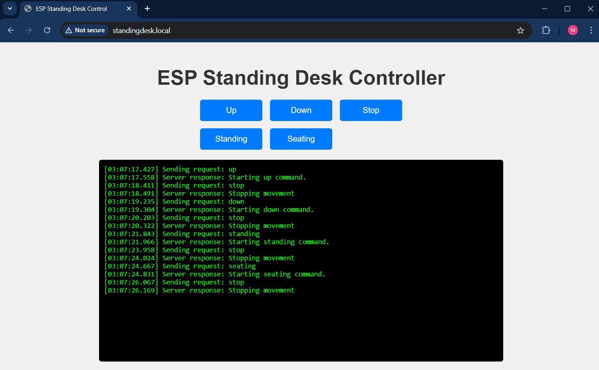

## ESP8266 Standing Desk Controller

I recently bought a Flexispot E1 Standing Desk but it came with a very basic controller so I thought why not give it some help using an ESP 8266 board.
The default controller only provides you with two buttons: Move up, Move down.

I created a very simple circuit on top of the existing controller with two resistors and two transistors to control the desk using the ESP.
Luckily, the microcontroller on the controller box operates at the same voltage as the ESP so I can power it directly from the same board.

Technically, the code can work on any standing desk given that you wire your circuit correctly.

## Functionality
Currently, the ESP connects to a wifi network (you have to provide the SSID and password in the Arduino code) and you can access the ESP locally with this URL: http://standingdesk.local
The default page provides you with a simple interface to control the desk from any device using 5 buttons:

 - Move Up
 - Move Down
 - Go to Standing Mode
 - Go to Seating Mode
 - Stop Movement

But I thought it'd be even easier to control it using my keyboard, so I wrote a simple Python script that does exactly this :D
The script will search for the ESP and retrieve the IP address automatically.
Then, you can control the desk using the following shortcuts:
 - Alt + Page Up: Move Up
 - Alt + Page Down: Move Down
 - Win + Page Up: Go to Standing Mode
 - Win + Page Down: Go to Seating Mode

Here are a couple of issues that need to be resolved:
 1. The code is not aware of the current desk height. There are quadrature encoders on the motors, I tried to decode the signals but the error rate was high so I just ignored it :D (maybe I didn't decode the signal correctly)
 2. No interface to set up the Wifi. Currently, the SSID and Password are hardcoded in the code, to change the network, you have to flash the ESP again to set up a new network :D

The project is not finished yet but I don't have much time to work on it at the moment, so I just uploaded my progress so far.
I'm happy with the results so far but there's always room for improvement.

## Useful Resources
- https://www.paulhempshall.com/blog/salvaged-adjustable-desk/
- https://blog.nerds.cool/2023/09/02/flexispot-standing-desk-custom-firmware-1-x/
- https://lastminuteengineers.com/esp8266-pinout-reference/
- https://www.dynapar.com/technology/encoder_basics/quadrature_encoder/